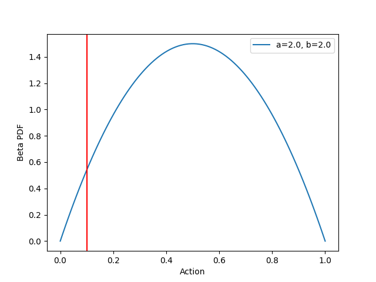
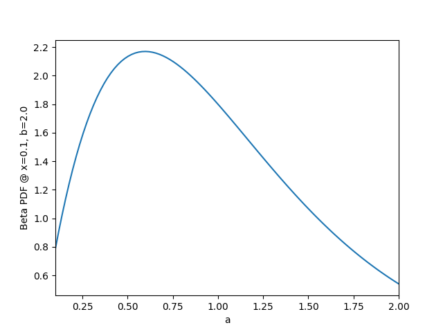
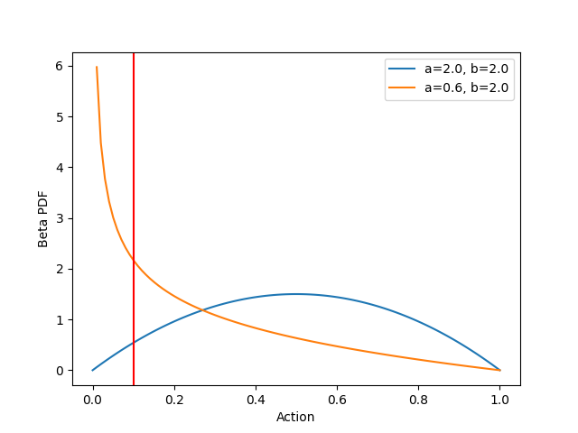

# Mountain Car with Continuous Control
* Content
{:toc}

# Introduction

### The Environment
This is similar to the [discrete-control mountain car](./mountain_car.md) except that, here, control is achieved through
continuous-valued forward and backward acceleration. You can read more about this environment 
[here](https://gym.openai.com/envs/MountainCarContinuous-v0/). Continuous control complicates the use of action-value 
estimation with tabular and function approximation methods, which assume that actions can be enumerated from a discrete 
set. Although it is possible to discretize a continuous action space and then apply action-value methods to the 
discretized space, the resulting estimators will need to cover an arbitrarily high dimensionality that is determined by 
the discretization resolution. A fundamentally different approach is called for and can be found in policy gradient 
methods. The continuous mountain car presents a simple setting in which to explore policy gradient methods, as there is 
only one action dimension:  accelerate with force ranging from [-1, +1], where negative forces accelerate to the left 
and positive forces accelerate to the right. The task for policy gradient methods is to model the action distribution 
(e.g., car acceleration) in terms of the state features (e.g., position and velocity of the car).

### The Beta Distribution
In the case of the continuous mountain car, the action distribution can be modeled with a 
[beta distribution](https://en.wikipedia.org/wiki/Beta_distribution) by rescaling the (0.0, 1.0) domain of the 
distribution to be (-1.0, 1.0). We'll proceed with the (0.0, 1.0) domain in our explanation, but keep in mind that this 
domain can be rescaled to any bounded interval. The beta distribution has two shape parameters `a` and `b` that can be 
used to generate a wide range of distributions. A few examples are shown below:


Varying the shape parameters can result in the uniform distribution (orange), concentrations at the boundaries of the 
domain (blue), or concentrations at any point along the domain (red, green, and purple). These concentrations can be as 
narrow or wide as desired. As indicated, the x-axis represents a continuous-valued action. Thus, if a single-action 
policy is defined to be the beta distribution, then we can do all the usual things with the policy:  sample actions from
it, reshape it, and integrate over it. If the environment defines more than one action dimension (e.g., one for 
forward/backward acceleration and one for braking force), then we could extend this approach to use two separate beta 
distributions, one for each action. We'll stick with a single action (beta distribution) in the case of the OpenAI 
continuous mountain car environment.

How do we connect the policy (i.e., the beta distribution) to the state features (i.e., the position and velocity of the 
car)? We do this by modeling the shape parameters in terms of the state features. For example, `a` could be modeled as 
one linear function of the state features, and `b` could be modeled as another linear function of the state features. 
The shape parameters for the beta PDF must be positive, so these linear functions could be implemented as follows:

```
a = np.exp(theta_a.dot(state_features))
b = np.exp(theta_b.dot(state_features))
```

where `theta_a` and `theta_b` are coefficients to be determined (see 
[here](https://github.com/MatthewGerber/rlai/blob/fe18f170d0171ef1642ec9e4ce33cdcd47a10816/src/rlai/policies/parameterized/continuous_action.py#L746)
for the actual implementation within RLAI, which is more complicated because it covers the more general case of multiple
actions). In this way, the state of the car determines the shape of the beta PDF, and the action chosen for the state is
determined by sampling this distribution. Everything hinges upon the identification of appropriate values for `theta_a`
and `theta_b`.

### Learning a Beta Distribution from Experience
How do we adapt the beta PDF's shape parameters in response to experience? As the name suggests, policy gradient methods
operate by calculating the gradient of the policy (e.g., the action's beta PDF) with respect to its shape parameters. 
As an example, consider the following beta distribution and imagine that we just sampled an action corresponding to 
`x=0.1` (indicated by the vertical red line):



Now suppose that this action `x=0.1` turned out to be positively rewarding. Intuition suggests that we should increase 
the probability of this action. How might this be done? Consider what happens to the beta PDF at `x=0.1` as we vary the 
shape parameter `a`. This is shown below:



As shown above, decreasing `a` from its original value of 2.0 to a value around 0.6 should increase the value of the 
beta PDF at `x=0.1` to near 2.2. The following figure confirms this, with the original distribution shown in blue and 
the revised distribution shown in orange:



As shown above, the revised distribution has greater density near our hypothetically rewarding action `x=0.1`, and the 
shape of the beta PDF has changed dramatically. Sampling the revised distribution will tend to produce actions less than
0.5.

### Automatic Differentiation with JAX
Above, we saw how the value of the beta PDF at `x=0.1` might change if we increase or decrease the shape parameters. In 
calculus terms, we are investigating the _gradient_ of the beta PDF at `x=0.1` _with respect to_ `a` and `b`. One could 
certainly apply the rules of differentiation to the beta PDF in order to arrive at functions for these gradients. 
Alternatively, one could use [JAX](https://github.com/google/jax) and write code such as the following:

```python
import jax.scipy.stats as jstats
from jax import grad

# 1. Define the function for which we want a gradient.
def jax_beta_pdf(
        x: float,
        a: float,
        b: float
):
    return jstats.beta.pdf(x=x, a=a, b=b, loc=0.0, scale=1.0)


# 2. Ask JAX for the gradient with respect to the second argument (shape parameter a).
jax_beta_pdf_grad = grad(jax_beta_pdf, argnums=1)

# 3. Calculate the gradient that we want.
print(f'{jax_beta_pdf_grad(0.1, 2.0, b=2.0)}')  # -0.7933964133262634
```

There's a lot going on here; however, it is ultimately _far_ simpler than attempting to apply the rules of 
differentiation to the beta PDF. The final line indicates that the gradient of interest is approximately equal to -0.79.
In other words, if we increase `a` by 1.0, then we'll change the beta PDF at `x=0.1` by -0.79. Given our hypothetical 
that `x=0.1` was found to be a positively rewarding action, we should therefore decrease `a` by some small amount. 
Conversely, if the gradient above had been positive, then we should increase `a` by some small amount. If we had found 
`x=0.1` to be negatively rewarding, then these moves would be flipped. In general, we move the policy's shape parameters
in the direction of the gradient multiplied by the (discounted) return. In code:

```
a  = a + alpha * discounted_return * gradient_at_x
```

where `a` is the current shape parameter, `alpha` is the step size, `discounted_return` is the signed discounted return obtained for an action `x`, and 
`gradient_at_x` is the gradient of the beta PDF at `x` with respect to shape parameter `a`. 

Note that we have been referring to the gradient of the beta PDF with respect to the shape parameters `a` and `b`. This
is accurate in a general sense. In the specific case of policy gradient methods for RL, `a` and `b` are modeled as 
linear functions of the state features. Thus, we do not directly update the values of `a` and `b`; rather, we update
the coefficients (`theta_a` and `theta_b`) in the linear functions for `a` and `b`. We do this by calculating gradients
of the beta PDF with respect to `theta_a` and `theta_b` and updating the coefficients accordingly, taking the sign of 
the return into account. The resulting concepts and code are much the same as what is shown above.

This high-level summary leaves open many questions:
* What step size should we use?
* How do we incorporate a "baseline" state-value function as described in the textbook?
* How do we model shape parameters as linear functions of state features and find the gradients?

All of these questions and more have been answered in code for the 
[policy gradient optimizer](https://github.com/MatthewGerber/rlai/blob/53152aae7738f5bd97b9fb5e24d39b8b93a4760c/src/rlai/policy_gradient/monte_carlo/reinforce.py#L16)
and the [beta distribution policy](https://github.com/MatthewGerber/rlai/blob/53152aae7738f5bd97b9fb5e24d39b8b93a4760c/src/rlai/policies/parameterized/continuous_action.py#L466).

# Development
A few key points of development are worth mentioning.

### Graphical Instrumentation
The approach taken here is substantially more complicated than, say, tabular action-value methods. We've got to 
understand how state features determine PDF shape parameters, how the shape parameters determine actions, and how 
actions generate returns that deviate from baseline state-value estimates that are estimated separately using 
traditional function approximation methods. RLAI instruments and displays many of these values in real time while
rendering OpenAI environments. An example screenshot is shown below:


* Top left:  Environment state features and reward value.
* Top middle:  Environment rendering.
* Top right:  Action values.
* Bottom left:  State-value estimate, which is used as a baseline in the REINFORCE policy gradient algorithm.
* Bottom right:  Shape parameters `a` and `b` for the beta PDF.

### Fuel Level
The mountain car environment does not include the concept of fuel. Instead, the reward value is reduced based on how 
much fuel is used. This isn't problematic, as the control agent will necessarily need to learn to climb to the goal 
quickly and efficiently to maximize reward. However, introducing a fuel level into the state is conceptually cleaner and 
better reflects actual driving dynamics. Within RLAI, an initial fuel level of 1.0 is set at the start of each episode, 
and throttle use depletes the fuel level accordingly. All rewards become zero once fuel runs out (see 
[here](https://github.com/MatthewGerber/rlai/blob/638c9a9e30036cb4d7feed7b9b4c0e61ef886884/src/rlai/environments/openai_gym.py#L191)
for details).

### Reward
By default, OpenAI only provides a positive reward when the car reaches the goal. Each step prior to the goal receives a
negative reward for fuel use. There is a default time limit of 200 steps, and the episode terminates upon reaching this 
limit. In this setup, a random policy might take many episodes to receive a positive reward. By providing intermediate 
rewards for partial climbs, the agent can learn more quickly. Within RLAI, this is done by rewarding the agent at the
apex of each climb up the right-side hill. The intermediate reward is the product of the fuel level and the percentage 
to goal at the apex of each climb. All intermediate rewards are therefore zero once all fuel is depleted. Upon reaching 
the goal, the reward is the _sum_ of the fuel level and the percentage to goal, the latter being 1.0 since the goal is 
reached. The sum (instead of product) is used for the goal reward to distinguish it from intermediate rewards.

### Gradient Transformations
The gradients of the beta PDF near its boundaries (with respect to `theta_a` and `theta_b`) can be much larger than the 
gradients at other `x` locations. This can cause problems because the step size `alpha` is constant. As usual in 
stochastic gradient descent (SGD), the step size must be sufficiently small to generate reasonable updates for all 
gradients. This is why we standardize the state-feature values in traditional SGD applications. However, standardizing 
the state-feature values does not keep the gradients of the beta PDF with respect to `theta_a` and `theta_b` within 
manageable ranges. To account for this, all gradients are passed through the hyperbolic tangent function (`tanh`) to 
ensure that they remain within [-1, +1].


# Training
The following command trains an agent for the continuous mountain car environment using policy gradient optimization 
with a baseline state-value estimator:

```
rlai train --random-seed 12345 --agent rlai.agents.mdp.StochasticMdpAgent --gamma 0.99 --environment rlai.environments.openai_gym.Gym --gym-id MountainCarContinuous-v0 --render-every-nth-episode 50 --video-directory ~/Desktop/mountaincar_continuous_videos --force --T 1000 --plot-environment --train-function rlai.policy_gradient.monte_carlo.reinforce.improve --num-episodes 500 --plot-state-value --v-S rlai.v_S.function_approximation.estimators.ApproximateStateValueEstimator --feature-extractor rlai.environments.openai_gym.ContinuousMountainCarFeatureExtractor --function-approximation-model rlai.models.sklearn.SKLearnSGD --loss squared_loss --sgd-alpha 0.0 --learning-rate constant --eta0 0.01 --policy rlai.policies.parameterized.continuous_action.ContinuousActionBetaDistributionPolicy --policy-feature-extractor rlai.environments.openai_gym.ContinuousMountainCarFeatureExtractor --alpha 0.01 --update-upon-every-visit True --plot-policy --save-agent-path ~/Desktop/mountaincar_continuous_agent.pickle
```

The argument are explained below.

### RLAI
* `train`:  Train the agent. 
* `--random-seed 12345`:  For reproducibility.

### Agent
* `--agent rlai.agents.mdp.StochasticMdpAgent`:  Standard stochastic MDP agent. 
* `--gamma 0.99`:  Slight discount, since episodes can be long and credit should not be passed all the way back to the 
start of the episode.

### Environment
* `--environment rlai.environments.openai_gym.Gym`:  Environment class.
* `--gym-id MountainCarContinuous-v0`:  OpenAI Gym environment identifier.
* `--render-every-nth-episode 50`:  Render a video every 50 episodes.
* `--video-directory ~/Desktop/mountaincar_continuous_videos`:  Where to store rendered videos.
* `--force`:  Overwrite videos in the video directory.
* `--T 1000`:  Limit episodes to 1000 steps.
* `--plot-environment`:  Show a real-time plot of state and reward values.

### Training Function and Episodes
* `--train-function rlai.policy_gradient.monte_carlo.reinforce.improve`:  Run the REINFORCE policy gradient optimization
algorithm.
* `--num-episodes 500`:  Run 500 episodes.

### Baseline State-Value Estimator
* `--plot-state-value`:  Show a real-time plot of the estimated baseline state value.
* `--v-S rlai.v_S.function_approximation.estimators.ApproximateStateValueEstimator`:  Baseline state-value estimator.  
* `--feature-extractor rlai.environments.openai_gym.ContinuousMountainCarFeatureExtractor`:  Feature extractor for the
baseline state-value estimator.
* `--function-approximation-model rlai.models.sklearn.SKLearnSGD`:  Use SKLearn's SGD for the baseline state-value 
estimator.
* `--loss squared_loss`:  Use a squared loss within the baseline state-value estimator.
* `--sgd-alpha 0.0`:  Do not use regularization.
* `--learning-rate constant`:  Use a constant learning rate schedule.
* `--eta0 0.01`:  Learning rate

### Policy
* `--policy rlai.policies.parameterized.continuous_action.ContinuousActionBetaDistributionPolicy`:  Use the beta
distribution to model the action-density distribution within the policy.
* `--policy-feature-extractor rlai.environments.openai_gym.ContinuousMountainCarFeatureExtractor`:  Feature extractor
for the policy gradient optimizer.
* `--alpha 0.01`:  Learning rate for policy gradient updates.
* `--update-upon-every-visit True`:  Update the policy's action-density distribution every time a state is encountered
  (as opposed to the first visit only).
* `--plot-policy`:  Show a real-time display of the action that is selected at each step.

### Output
* `-save-agent-path ~/Desktop/mountaincar_continuous_agent.pickle`:  Where to save the final agent.

The following videos show snapshots of the training process.

Episode 0:



Episode 50:



Episode 250:



# Results

Coming soon...