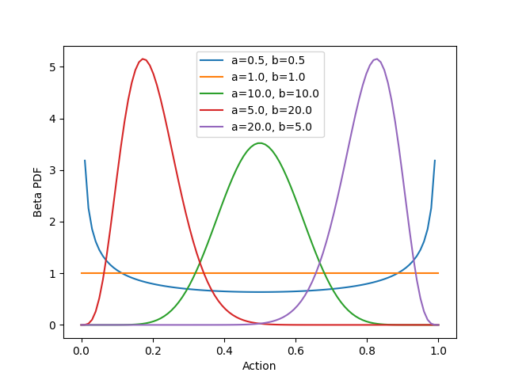
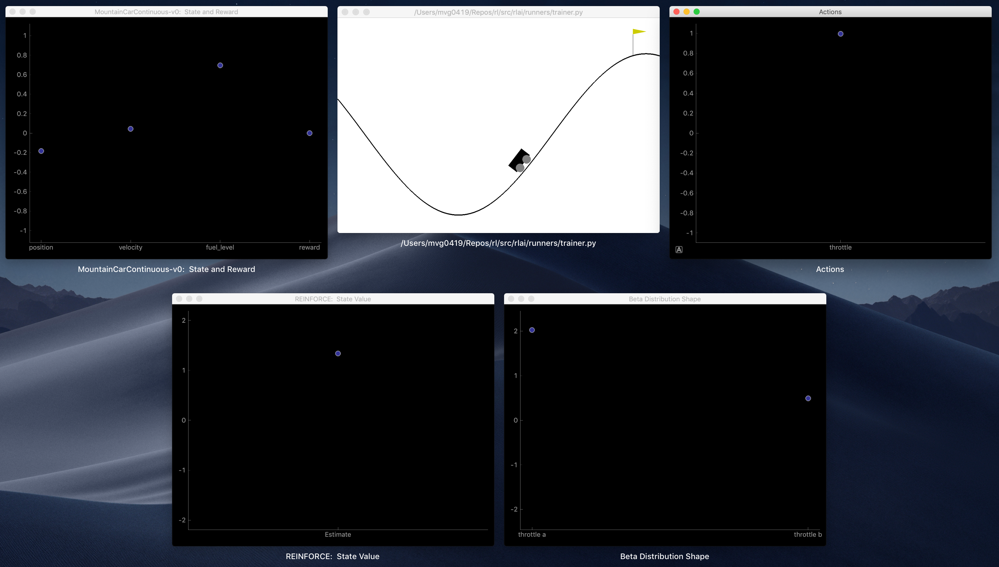

# Mountain Car with Continuous Control
* Content
{:toc}

# Introduction

## The Environment
This is similar to the [discrete-control mountain car](./mountain_car.md) except that, here, control is achieved through
continuous-valued forward and backward acceleration. You can read more about this environment 
[here](https://gym.openai.com/envs/MountainCarContinuous-v0/). The need for continuous control complicates the use of action-value
estimation, which assumes that actions can be enumerated from a discrete set. Although it is possible to discretize the
continuous action space and then apply action-value methods to the discretized space, the resulting estimator will need
to cover an arbitrarily high dimensionality that is only limited by the discretization resolution. A fundamentally 
different approach is called for and can be found in policy gradient methods. The continuous mountain car presents a 
simple setting in which to explore policy gradient methods, as there is only one action dimension:  accelerate with 
force ranging from [-1, +1], where negative forces accelerate to the left and positive forces accelerate to the right.
The task for policy gradient methods is to model the action distribution (e.g., car acceleration) in terms of the 
state features (e.g., position and velocity of the car).

## The Beta Distribution
In the case of the mountain car, the action distribution can be modeled with a 
[beta distribution](https://en.wikipedia.org/wiki/Beta_distribution) by rescaling the domain of the distribution to be 
[-1, +1]. The beta distribution has two shape parameters that can be used to generate a wide range of distributions over 
a bounded interval. A few examples are provided below:



Varying the two shape parameters (`a` and `b`) can result in the uniform distribution (orange), concentrations at the 
boundaries of the domain (blue), or concentrations at any point along the domain (red, green, and purple), and these 
concentrations can be as narrow or wide as desired. As indicated, the x-axis represents a continuous-valued action. 
Thus, if our single-action policy is defined to be the beta distribution, then we can do all of the usual things with 
the policy:  sample from it, reshape it, integrate over it, etc. If the policy defines more than one action dimension
(e.g., one for forward/backward acceleration and one for brake force), then one could extend this approach to use two 
separate beta distributions. However, we'll stick with a single action (beta distribution) in the case of the OpenAI 
mountain car environment.

What's the connection between the beta distribution (i.e., the policy) and the state features (i.e., the position and 
velocity of the car)? The connection is made by modeling the shape parameters in terms of the state features. For 
example, `a` could be modeled as one linear function of state features, and `b` could be modeled as another linear 
function of the state features. In this way, the state of the car determines the shape of the action distribution (see 
above for a few possibilities), and the action chosen for the state is determined by drawing a sample from the resulting 
distribution.

## Learning a Beta Distribution from Experience
One important consideration is how to adapt the shape parameters' models in response to experience. As the name 
suggests, policy gradient methods operate by calculating the gradient of the policy (i.e., the action's beta 
distribution) with respect to its shape. As an example, consider the following beta distribution and imagine that we 
just sampled an action corresponding to `x=0.1` (indicated by the vertical red line):


Now suppose that this action `x=0.1` turned out to be positively rewarding. Intuition suggests that we should increase 
the probability of this action. How might this be done? Consider what happens to the beta PDF at `x=0.1` as we vary the 
shape parameter `a`. This is shown below:


As shown above, decreasing `a` from its original value of 2.0 to a value around 0.6 should increase the value of the 
beta PDF to a value greater than 2.0. The following figure shows what happens when we do this (the original distribution 
is shown in blue and the revised distribution is shown in orange):


As shown above, the revised distribution has much greater density near our hypothetically rewarding action `x=0.1`.

## Automatic Differentiation with JAX
Above, we asked how the value of the beta PDF at `x=0.1` might change if we increase or decrease the shape parameters. 
In calculus terms, we are interested in the gradient of the beta PDF at `x=0.1` with respect to `a` and `b`. One could 
certainly attempt to apply the rules of differentiation to the beta PDF in order to arrive at functions for these 
gradients. Alternatively, one could write code such as the following:

```python
import jax.scipy.stats as jstats
from jax import grad

# 1. Define the function for which we want a gradient.
def jax_beta_pdf(
        x: float,
        a: float,
        b: float
):
    return jstats.beta.pdf(x=x, a=a, b=b, loc=0.0, scale=1.0)


# 2. Ask JAX for the gradient with respect to the second argument (shape parameter a).
jax_beta_pdf_grad = grad(jax_beta_pdf, argnums=1)

# 3. Calculate the gradient that we want.
print(f'{jax_beta_pdf_grad(0.1, 2.0, b=2.0)}')  # -0.7933964133262634
```

There's a fair bit going on here; however, it is ultimately _far_ simpler than attempting to apply the rules of 
differentiation to the beta PDF. The final line indicates that the gradient of interest is approximately equal to -0.79.
In other words, if we increase `a` by 1 we'll change the beta PDF at `x=0.1` by -0.79. Given our hypothetical that 
`x=0.1` was found to be a positively rewarding action, we should therefore decrease `a` by some small amount. 
Conversely, if the gradient above had been positive, we would have increased `a` by some small amount. If we had found 
`x=0.1` to be negatively rewarding, then these moves would be flipped. In general, we have:

```python
a  = a + alpha * discounted_return * gradient_at_x
```

where `alpha` is the step size, `discounted_return` is the signed discounted return obtained for an action `x`, and 
`gradient_at_x` is the gradient of the beta PDF at `x` with respect to shape parameter `a`. 

Note that we have been referring to the gradient of the beta PDF with respect to the shape parameters `a` and `b`. This
keeps things simple. However, as mentioned above, `a` and `b` are modeled as linear functions of the state features. The 
coefficients in these linear functions are the real focus, as the shape of the action distribution is ultimately 
determined by the state of the environment. So, instead of talking about the gradient of the beta PDF at `x` with 
respect to `a` or `b`, we talk about the gradients with respect to the parameters of these linear functions. The 
resulting concepts and code are much the same as what is shown above.

This high-level summary leaves open many questions:
* What step size should we use?
* How do we incorporate a "baseline" value function as described in the textbook?
* How do we model shape parameters as linear functions of state features?

All of these questions and more have been answered in code for the 
[policy gradient optimizer](https://github.com/MatthewGerber/rlai/blob/53152aae7738f5bd97b9fb5e24d39b8b93a4760c/src/rlai/policy_gradient/monte_carlo/reinforce.py#L16)
and the [beta distribution policy](https://github.com/MatthewGerber/rlai/blob/53152aae7738f5bd97b9fb5e24d39b8b93a4760c/src/rlai/policies/parameterized/continuous_action.py#L466).

# Development
A few key points of development are worth mentioning.

## Graphical Instrumentation
The approach taken here is substantially more complicated than, say, tabular action-value methods. We've got to 
understand how state features determine PDF shape parameters, how the shape parameters determine actions, and how 
actions generate returns that deviate from baseline state-value estimates that are estimated separately using 
traditional function approximation methods. RLAI instruments and displays many of these values in real time while
rendering OpenAI environments. An example screenshot is shown below:



* Top left:  Environment state features and reward value.
* Top middle:  Environment rendering.
* Top right:  Action values.
* Bottom left:  State-value estimate, which is used as a baseline in the REINFORCE policy gradient algorithm.
* Bottom right:  Shape parameters `a` and `b` for the beta PDF.

## Fuel Level
The mountain car environment does not include the concept of fuel. Instead the reward value is reduced based on how much 
fuel is used. This isn't problematic, as the control agent will necessarily need to learn to climb to the goal quickly 
and efficiently to maximize reward. However, introducing a fuel level into the state and removing it from the reward is 
conceptually cleaner and better reflects actual driving. Within RLAI, an initial fuel level of 1.0 is set at the start 
of each episode, and throttle use depletes the fuel level accordingly. All rewards become zero once fuel runs out (see 
[here](https://github.com/MatthewGerber/rlai/blob/638c9a9e30036cb4d7feed7b9b4c0e61ef886884/src/rlai/environments/openai_gym.py#L191)
for details).

## Reward
By default, OpenAI only provides a positive reward when the car reaches the goal. Each step prior to the goal receives a
negative reward for fuel use. There is a default time limit of 200 steps, and the episode terminates upon reaching this 
limit. In this setup, a random policy might take many episodes to receive a positive reward. By providing intermediate 
rewards for partial climbs, the agent can learn more quickly. Within RLAI, this is done by rewarding the agent at the
apex of each climb up the right-side hill. The reward is the product of the fuel level and the percentage to goal at the 
apex of each climb. All intermediate rewards are therefore zero once all fuel is depleted. Upon reaching the goal, the 
reward is the _sum_ of the fuel level and the percentage to goal, the latter being 1.0 since the goal is reached. The 
sum is used for the goal reward to distinguish it from intermediate rewards.

## Gradient Transformations
The gradient of the beta PDF near its boundaries (with respect to it shape parameters `a` and `b`) can be much larger 
than the gradient at other `x` locations. This can cause problems because the step size `alpha` is constant. As usual in 
stochastic gradient descent (SGD), the step size must be sufficiently small to generate reasonable updates for all 
gradients. This is why we standardize the state-feature values in traditional SGD applications. However, standardizing 
the state-feature values does not keep the gradients with respect to the shape parameters `a` and `b` within manageable 
ranges. I ran each gradient through the hyperbolic tangent function (`tanh`) to ensure that all gradients are within 
[-1, +1]. This seemed like a hack, and I'm not sure what effect this has on the theoretical properties of the method. 
However, it does appear to work.


# Training

Coming soon...

# Results

Coming soon...