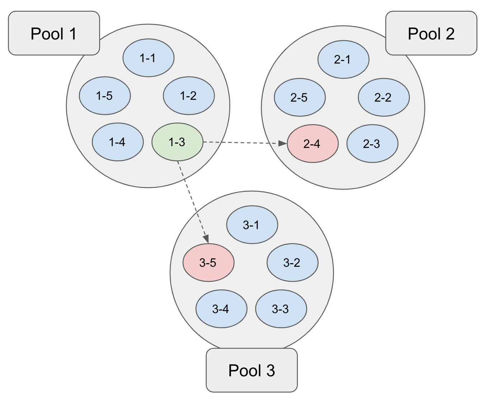

# [Home](../index.md) -> MuJoCo Swimming Worm (Pooled Processes)
* Content
{:toc}

# Introduction
One hurdle in developing a control agent for the MuJoCo swimming worm was runtime (see [here](mujoco_swimming_worm.md)).
It took ~70,000 training episodes and ~3 days of runtime to train the agent. Several factors contribute to the 
runtime:  policy dimensionality, learning rates, the speed of simulation via `gym` and `mujoco-py`, and the speed of 
JAX to calculate policy gradients. Instead of working to mitigate these issues, I was curious to explore the use of 
multiple CPU cores during training. My first version linked above ran on a single CPU core. How should multiple CPU 
cores be leveraged? I was certain that this question had been answered many times in many ways, and it is likely that 
CPU cores far underperform GPU pipelines. However, CPU cores are a natural progression, and I've got no real purpose 
here except to enjoy the progression.

# Concept
I tried several approaches that did not work.

1. I had each process/core work on its own subpool of agents. Periodically, the processes would exchange their best
   known agents with each other. This is depicted below:
   
   In this example, each of three processes works on a set of five agents, spending a fixed number of REINFORCE episodes
   improving each agent. After each subpool has been improved, the best agent among all (i.e., `1-3`) takes the place of 
   the worst agents in the other pools (i.e., `2-4` and `3-5`). However, maintaining more agents than available CPU 
   cores performed poorly, since any work on a suboptimal agent in a subpool was a distraction from improving the best 
   overall agent in the population.
1. I then compounded the previous poor performance by introducing a low (epsilon) probability of a subpool process 
   selecting not the best agent from other pools but a random agent from across all subpools. This slowed things down 
   even further.
1. ...
1. ... (I tried several variations on the above ideas without success.)
1. ...

Two things gradually became clear:

1. Each process should attempt to improve the best known agent for a short amount of time. That is, the picture should 
   look as follows:
   
   In the above figure, the training pool of `1-1`, `1-2`, and `1-3` originates with the same agent `1`, which is the 
   initial (random) agent here but is generally the best agent thus far. Each of the three processes independently 
   improves this agent for a few episodes (here 10) resulting in `1-1'`, `1-2'`, and `1-3'`. Each process in the pool is 
   exploring independently by sampling the beta distributions that underlie its policy. Thus, a larger training pool 
   provides more efficient exploration.
1. If `1-1'`, `1-2'`, and `1-3'` are all we have, then it's not entirely clear how we should proceed. Each updated agent
   on the trajectory from `1-1` to `1-1'` corresponds to a different REINFORCE epioode, and the rewards in these 
   intermediate episodes do not comment purely on the goodness of `1-1'`. Thus, I introduced an evaluation phase in 
   which `1-1'`, `1-2'`, and `1-3'` are run for several episodes without policy updates to obtain an average reward. 
   These average rewards determine which agent in the pool is promoted to the next iteration (`1-3'` in the above 
   example), and then the procedure repeats.

# Implementation
The implementation relies on process-level parallelization of RLAI optimizers. Each process is provided with arguments
specifying a shared directory into which the processes are expected to deposit their resulting agents and associated 
evaluation metrics. The processes are synchronized by their expectation of how many such deposits will arrive, and when 
these expectations are met each process evaluates all deposited agents to select the best in the exploration pool (see
figure above). As shown below, this approach affords the flexibility to parameterize the processes differently (e.g., 
with different learning rates) and achieve exploration gains.

# Training
See [here](https://github.com/MatthewGerber/rlai/blob/master/trained_agents/swimmer/pooled/swimmer_pool.sh) for the 
complete shell script that invokes RLAI with process pooling. Key differences between the 
[single-process](mujoco_swimming_worm.md) and the multi-process RLAI invocations used here are listed below.

### Shell Variables
* `num_runners=10`:  Use 10 independent RLAI processes.
* `eta_values=(0.0001 0.001 0.001 0.001 0.001 0.001 0.001 0.001 0.001 0.001)`:  Per-process learning rates for baseline 
  state-value estimator.  
* `alpha_values=(0.00001 0.0001 0.0001 0.0001 0.0001 0.0001 0.0001 0.0001 0.0001 0.0001)`:  Per-process step sizes for
  policy gradient updates.

In the learning rates and step sizes above, note that all are the same except for the first process, which has 1/10th
the values of the others. This is intended to guard against cases in which updates are too large and produce degenerate
policies. Because all 10 agents are compared on the basis of their evaluation scores, these degenerate policies will be 
demoted in favor of the policy resulting from smaller updates. At least, this is the intent. I haven't explored it all
that much.
  
### RLAI Arguments
* `--random-seed "1234${n}"`:  Per-process random seeds, which need to be different to ensure effective exploration.
* `--alpha "${alpha_values[$n]}"`:  See above.
* `--training-pool-directory ~/Desktop/swimmer_pool`:  Directory into which per-process agents will be deposited after 
  evaluation.
* `--training-pool-count ${num_runners}`:  Number of processes. 
* `--training-pool-iterate-episodes 10`:  Number of REINFORCE episodes to run with policy gradient updates, prior to 
  evaluation.
* `--training-pool-evaluate-episodes 10`:  Number of evaluation episodes to run with the agent without modifying its 
  policy. The average score resulting from this evaluation is used to compare the agent with others in the pool, once 
  all processes have finished their training and evaluation episodes.

# Results

The following figure shows average evaluation reward for each iteration:

Training took 2.45 minutes per pool iteration for 400 iterations, which gives a total runtime of ~16 hours. This is a 
78% reduction compared with the [single-process](mujoco_swimming_worm.md) approach, which had a runtime of ~72 hours.
Furthermore, the agent here is far more effective in terms of distance traveled. The resulting agent is shown below:



