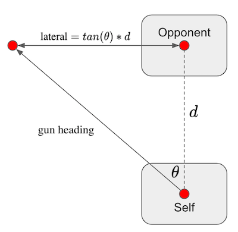
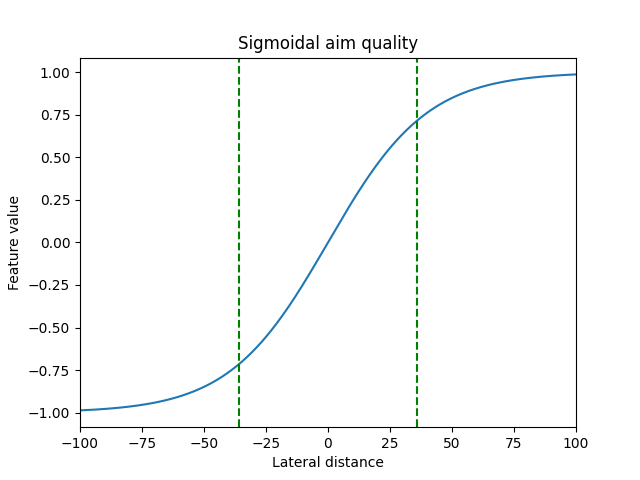
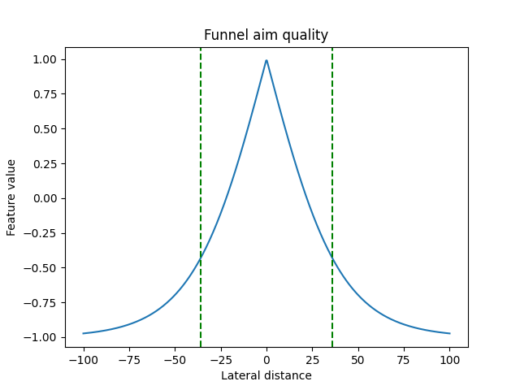
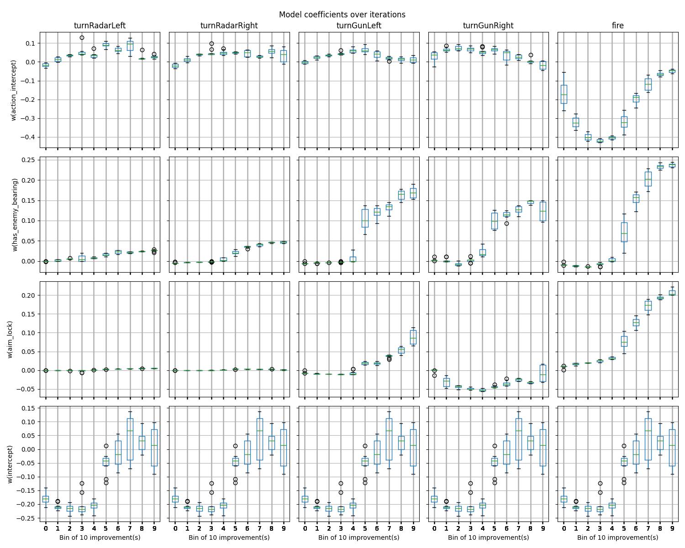

# Robocode
Robocode is a programming game in which robot agents are programmed to operate in a simulated battle environment. Full
documentation about the game can be found [here](https://robowiki.net/wiki/Main_Page). Robocode has several features
that make it an appealing testbed for reinforcement learning:

* Rich dynamics:  The state space is continuous, and each robot has several dimensions of interrelated action, some of
  which are discrete (fire or not) and some of which are continuous (rotation of the robot, gun, and radar). There are 
  many options for reward functions. The [official scoring function](https://robowiki.net/wiki/Robocode/Scoring) is a 
  mixture of many variables, and simpler reward functions can be designed (e.g., bullet hit percentage, robot energy 
  level lost or gained).
* Multi-agent with teaming:  Robocode is inherently multi-agent. Teams can be formed, and team members can communicate
  by passing messages to each other.
* Integration with `rlai`:  The architecture of Robocode lends itself to integration with `rlai` via local network-based 
  exchange of state and action information.
  
The purpose of this case study is to explore the use of `rlai` for learning robot policies.

# Installing Robocode

1. Download the Robocode installer 
   [here](https://github.com/MatthewGerber/robocode/raw/master/build/robocode-rlai-setup.jar). This is a customized 
   build of Robocode that has been modified to make it compatible with `rlai`. This build provides robots with elevated 
   permissions, particularly (1) permission to use TCP (socket) communication with the localhost (127.0.0.1) and (2)
   permission to perform reflection-based inspection of objects. These permissions are needed to communicate with the 
   `rlai` server, and in general they do not pose much of a security risk; however, it is probably a good idea to avoid 
   importing other robots into this installation of Robocode.
1. Run the Robocode installer. Install to a directory such as `robocode_rlai`.

# Running Robocode with `rlai`

1. Start the Robocode `rlai` environment. This is most easily done using the 
   [JupyterLab notebook](../jupyterlab_guide.md). There is already a configuration saved in the notebook that should 
   suffice as a demonstration of reinforcement learning with Robocode. Load the configuration and start it.
1. Start Robocode from the directory into which you installed it above. Add a few robots as well as the `RlaiRobot`, 
   then begin the battle. If this is successful, then you will see the `RlaiRobot` moving, firing, etc. This is the 
   start of training, so the agent will likely appear random until its policy develops.
1. In order to restart training with different parameters, you will need to first restart the Robocode application and 
   then restart the `rlai` environment by killing the command (if using the CLI) or by restarting the JupyterLab kernel. 
   This is a bit tedious but is required to reset the state of each.

# Development of a RL Robot for Robocode
The following sections explore the development of a RL robot for Robocode. The approach taken here is incremental and
focuses on developing particular skills, rather than addressing the entire behavior policy at once. Each section links
to a GitHub commit marking the code and configurations that were used. The layout of each section is as follows:

* Reward Signal:  Where we define the reward signal.
* State Features:  Where we list the state features per action. A brief explanation is given for the expected learning 
  outcome (ELO) of each feature. Each action has its own intercept term (constant), which quantifies the action's return 
  when its variables are set to zero. Essentially, we are modeling each action's value as a linear function of 
  (potentially nonlinear) features, independently of the other actions.
* Learning Model:  Where we list other hyperparameters of the value function model.
* Results:  Where we discuss results.

## Radar-Driven Aiming Against a Stationary Opponent ([GitHub](https://github.com/MatthewGerber/rlai/tree/204da60f432ece551e12cdfa0435ff1dbf6fc6af))

### Introduction
This section develops radar-driven aiming against a stationary opponent. The RL robot is also stationary but is allowed
to rotate both its radar (to obtain bearings on the opponent) and its gun (to orient the gun with respect to the
opponent's bearing).

### Reward Signal
The reward signal at each time step is defined as the sum of bullet power that has hit the opponent, minus the sum of
bullet power that has missed the opponent.

### State Features
* Action 1:  Turn radar left 5 degrees
  * **Feature 1 - Opponent bearing exists (binary)** _ELO_:  Rotate radar left when `false` and do not rotate radar when 
    `true`.
    
* Actions 2/3:  Turn gun left/right 5 degrees
  * **Feature 1 - Has bearing on opponent (binary)** _ELO_:  Keep gun stationary when `false` and rotate gun when `true`.
  * **Feature 2 - Gun is counterclockwise from opponent (binary)** _ELO_:  Rotate gun clockwise when `true` and counterclockwise when `false`.
    
* Action 4:  Fire
  * **Feature 1 - Has bearing on opponent (binary)** _ELO_:  Do not fire when `false` and consider firing when `true`.
  * **Feature 2 - Square root of degree deviation from gun to opponent (continuous)** _ELO_:  Only fire gun when sufficiently well aimed.

### Learning Model and Training
Key model parameters are listed below:

* SARSA state-action value estimation (n-step=100)
* Discounted (gamma=0.99)
* Epsilon greedy (epsilon=0.2)
* Stochastic gradient descent (step size=0.001)
* Number of Robocode training rounds:  30

The full training command with all parameters is listed below:

```
rlai train --random-seed 12345 --agent rlai.agents.mdp.StochasticMdpAgent --gamma 0.99 --environment rlai.environments.robocode.RobocodeEnvironment --port 54321 --train-function rlai.gpi.temporal_difference.iteration.iterate_value_q_pi --mode SARSA --n-steps 100 --num-improvements 1000 --num-episodes-per-improvement 1 --num-updates-per-improvement 1 --make-final-policy-greedy True --num-improvements-per-plot 5 --save-agent-path ~/Desktop/robot_agent.pickle --q-S-A rlai.value_estimation.function_approximation.estimators.ApproximateStateActionValueEstimator --epsilon 0.2 --plot-model --plot-model-per-improvements 5 --function-approximation-model rlai.value_estimation.function_approximation.models.sklearn.SKLearnSGD --loss squared_loss --sgd-alpha 0.0 --learning-rate constant --eta0 0.001 --feature-extractor rlai.environments.robocode.RobocodeFeatureExtractor
```

Running this training command in the [JupyterLab notebook](../jupyterlab_guide.md) is shown below:



### Results
The policy learned above produces the following Robocode battle:



In the video, the game rate is being manually adjusted to highlight early segments of the first few rounds and then 
speed through the rest of the battle (see the slider at the bottom). It is clear that the agent has developed a tactic 
of holding fire at the start of each round while rotating the radar to obtain a bearing on the opponent. Once a bearing 
is obtained, the gun is rotated accordingly and firing begins when the gun's aim is sufficiently close. All ELOs seem to 
be satisfied by this approach.

## Radar-Driven Aiming Against a Mobile Opponent ([GitHub](https://github.com/MatthewGerber/rlai/tree/bb019d78ff11f46cddc465cca718d014e0db203c))

### Introduction
This section develops radar-driven aiming against a mobile opponent. The RL robot is stationary but is allowed to rotate 
both its radar (to obtain bearings on the opponent) and its gun (to orient the gun with respect to the opponent's 
bearing). A mobile opponent introduces the following challenges:

* Unreliability of enemy bearings:  An enemy bearing obtained at time `t` is unlikely to be correct at time `t+1`.
* Coordination of radar and gun rotation:  Enemy bearings are obtained by rotating the radar, which will need to be done 
  frequently given the unreliability of enemy bearings. Run rotation will need to be coordinated with radar rotation in 
  order to aim effectively.
* Planning for bullet travel time:  Bullets travel at finite speed, so aiming at a mobile opponent will need to account 
  for the enemy's velocity and distance from the gun.


### Reward Signal
The reward signal at each time step is defined as the sum of bullet power that hit the opponent, minus the sum of
bullet power that missed the opponent. One difficulty that arose in the current development iteration pertains to 
reward delay and discounting. Many time steps elapse from the time a bullet is fired until it registers as a hit or 
miss. It is likely that the robot will take many actions during these intervening time steps, but none of these actions
can possibly influence the outcome of the previously fired bullet. If we take the usual approach of discounting the 
bullet's reward starting at the time when it hits or misses, then it becomes difficult to construct an appropriate 
discount. On one hand, we want the time step associated with the bullet firing to receive full credit for the subsequent
hit or miss outcome. This would require us to eliminate discounting (i.e., `gamma=1.0`). On the other hand, we know that 
actions intervening between the firing of the bullet and the bullet's hit or miss outcomee should receive no credit. 
This would require us to discount entirely (i.e., `gamma=0.0`). In the usual discounting approach, we cannot 
simultaneously assign full credit to the bullet firing action while also assigning zero credit to actions that intervene
between firing and the bullet's outcome. A solution is to move away from the usual discounting approach. The 
alternative taken here is shown below:


In this alternative, the hit or miss outcome is shifted without discounting to the time at which the bullet was fired.
The usual discounting is applied starting at this time step and working backward through actions taken prior to firing.

### State Features
The state features described in this section make heavy use of two general concepts that are described below.

* Enemy bearing indicator:  This is a binary indication of whether the enemy's bearing is known. As described in the 
  introduction to this section, one cannot assume (as in the previous development iteration) that the enemy's bearing 
  will remain reliable after acquisition, since the enemy is moving. Here we only retain the enemy's bearing for the 
  time step in which it was acquired. If in the next time step the radar has left the enemy, then all binary indications 
  of the enemy's bearing will be `false`.
* Aim quality via lateral distance:  Aiming the radar or gun usefully (i.e., in a way that will gain positive 
  reward) requires an estimate of where the bullet will arrive in relation to the enemy position. A useful notion here 
  is that of lateral distance. This is depicted below:
  
  

  As shown in the figure, lateral distance is a measure of how far the bullet would be from the opponent given the gun's 
  heading, the distance to the opponent, and instantaneous arrival of the bullet at its destination. Here, negative 
  distances arrive to the left of the opponent, and positive distances arrive to the right. Of course, the opponent is 
  likely to be moving while the bullet is traveling, but setting this aside for now the lateral distance is a helpful 
  measurement of aim quality. For gun heading values <= -90 degrees and >= +90, the lateral distance is defined to be 
  negative infinity and positive infinity, respectively. We will need to transform lateral distance values in order to 
  use them as state features, for at least two reasons. First, the finite distances are unbounded and are on different 
  scales than other features. Feature scaling causes problems in the selection of the step size for stochastic gradient 
  descent, which is used here. Second, infinite values cannot be used regardless of scaling considerations. Relevant 
  transformations will be explained below.

* Action 1/2:  Turn radar left/right 5 degrees
  * **Feature 1 - Opponent bearing exists (binary)** _ELO_:  Rotate radar either left or right when `false` and do not 
    rotate radar when `true`.
  * **Feature 2 - Signed squash of lateral distance** The lateral distance from the radar to the opponent is 
    transformed to be in [-1.0, 1.0] using the sigmoidal squashing function shown below:
    
    
    
    Dashed reference lines are drawn at -36 and +36, marking the width of Robocode robots. This transformation handles 
    infinite negative and positive values, which converge to -1.0 and +1.0, respectively. _ELO_:  Rotate radar to the 
    right when the squashed value is negative and to the left when the squashed value is positive.
    
* Action 3/4:  Turn gun left/right 5 degrees
  * **Feature 1 - Has bearing on opponent (binary)** _ELO_:  Keep gun stationary when `false` and consider rotating gun 
    either left or right when `true`.
  * **Feature 2 - Signed squash of lateral distance** (same as for radar, see above).
    
* Action 5:  Fire
  * **Feature 1 - Has bearing on opponent (binary)** _ELO_:  Do not fire when `false` and consider firing when `true`.
  * **Feature 2 - Funneled lateral distance** For the purpose of deciding whether to fire, it might not help to 
    distinguish left (negative) from right (positive) lateral distance. As such, the lateral distance is funneled as 
    shown below:
    
    
    
    In a future development iteration, it would be interesting to try shifting the funnel's peak to be negative or
    positive to compensate for the opponent's velocity and distance from the gun. _ELO_:  Only fire gun when 
    sufficiently well aimed.
    
A useful consequence of transforming lateral distances as described above is that there is no need for an extra step of 
feature standardization, which was used in the previous iteration but found to be unnecessary here.
    
### Learning Model and Training
Key model parameters are listed below:

* SARSA state-action value estimation (n-step=500)
* Discounted (gamma=0.9)
* Epsilon greedy (epsilon=0.15)
* Stochastic gradient descent (step size=0.0005)
* Number of Robocode training rounds:  100

The full training command with all parameters is listed below:

```
rlai train --save-agent-path ~/Desktop/robot_agent.pickle --random-seed 12345 --agent rlai.agents.mdp.StochasticMdpAgent --gamma 0.9 --environment rlai.environments.robocode.RobocodeEnvironment --port 54321 --train-function rlai.gpi.temporal_difference.iteration.iterate_value_q_pi --mode SARSA --n-steps 500 --num-improvements 100 --num-episodes-per-improvement 1 --num-updates-per-improvement 1 --make-final-policy-greedy True --num-improvements-per-plot 5 --q-S-A rlai.value_estimation.function_approximation.estimators.ApproximateStateActionValueEstimator --epsilon 0.15 --plot-model --plot-model-per-improvements 5 --function-approximation-model rlai.value_estimation.function_approximation.models.sklearn.SKLearnSGD --loss squared_loss --sgd-alpha 0.0 --learning-rate constant --eta0 0.0005 --feature-extractor rlai.environments.robocode.RobocodeFeatureExtractor
```

Running this training command in the [JupyterLab notebook](../jupyterlab_guide.md) is shown below:



Boxplots of the model coefficients for each action are shown below:



In the boxplots above, the y-axes show feature weights, and the x-axes bin the training iterations (battle rounds) into 
groups of 10. The first 10 rounds are in bin 0, and the final 10 rounds are in bin 9. A few observations above 
these boxplots:

* Obtaining a bearing on the opponent (second row) increases the value of turning the gun left or right as well as
  firing.
* The aim quality features described above are shown in the third row where they are named `aim_lock`. Note that the 
  signed sigmoidal feature used for turning the gun has a positive weight for turning the gun left. This is interpreted 
  as assigning negative value to turning the gun left when the gun is already left of the opponent, whereas the value of
  turning the gun left when the gun is right of the opponent is positive. The weight of this feature for turning the gun 
  right is generally negative, reversing the interpretation. All of this makes sense.
* The aim quality feature for firing (row three, final column) is strongly positive.

In general, these feature weights are consistent with the ELOs and intuition.

### Results
The policy learned above produces the following Robocode battle:



Having experimented with the features, model parameters, and learned policies obtained in this iteration, it appears 
that most of the ELOs are satisfied. However, the radar was not expected to exhibit the behavior shown above, where it 
rotates continuously. The radar was expected to stay fixated on the opponent, as this would provide the most up-to-date 
bearings to the opponent. Training was performed several times, and this was always the successful policy that emerged. 
What's going on? The answer likely lies in the specification of the reward signal, which instructs the agent to maximize
bullet hits and minimize bullet misses. This objective does not differentiate the policy shown in the preceding video
from an alternative in which the radar remains fixated continuously on the opponent. If the reward were redesigned to 
emphasize bullet hits per turn, then the alternative (radar fixation) would likely be favored because it would enable 
accurate, high-rate firing.

Primary points of future development:

* Shift the aim quality feature for firing (i.e., the funnel's peak) left or right to compensate for the opponent's velocity and 
distance from the gun.
* Redefine the reward to emphasize hits per turn.

## Evasive Movement (TBD)

## Continuous Control (TBD)
