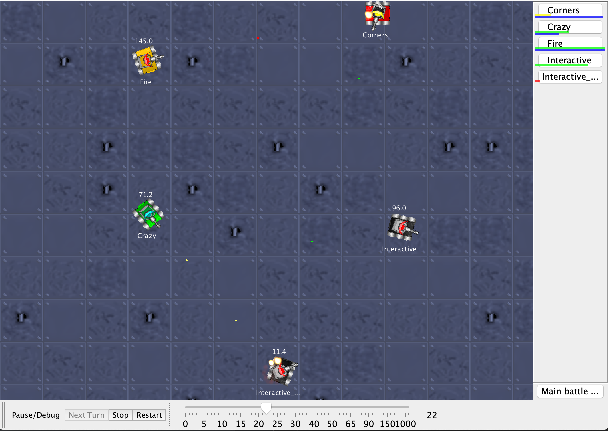

# Robocode
Robocode is a programming game in which robot agents are programmed to operate in a simulated battle environment. Full
documentation about the game can be found [here](https://robowiki.net/wiki/Main_Page). Robocode has several features
that make it an ideal testbed for reinforcement learning:

* Rich dynamics:  The state space is continuous, and each robot has several dimensions of interrelated action, some of
  which are discrete (fire or not) and some of which are continuous (gun and robot rotation). There are many options for
  reward functions. The [official scoring function](https://robowiki.net/wiki/Robocode/Scoring) is a mixture of many
  variables, but simpler reward functions (e.g., robot energy level lost or gained) can be defined.
* Multi-agent with teaming:  Robocode is inherently multi-agent. Teams can be formed, and team members can communicate
  by passing messages to each other.
* Simple integration with `rlai`:  The architecture of Robocode lends itself to a simple integration with `rlai` via
local network-based exchange of state and action information.
  
The purpose of this case study is to explore the use of `rlai` for learning robot policies.

## Installing and Configuring Robocode.

1. Download the Robocode installer [here](https://sourceforge.net/projects/robocode/files/latest/download).
1. Run the installer. The installation directory will be `ROBO` in the following steps.
1. Edit the `ROBO/robocode.sh` file. Add `-DNOSECURITY=true` so that the command starts with 
   `java -DNOSECURITY=true -Xmx512M ...`. NOTE:  This change causes Robocode to run without a security manager. This is
   required in order for Robocode to communicate with `rlai`; however, it also means that Robocode (and any robots that
   you have installed) can execute arbitrary code on your machine. As a safety precaution, start with a fresh Robocode
   installation and do not install any robots except for the official `rlai` robot.
1. Start Robocode and import the `rlai` robot.

## (Under Construction)
