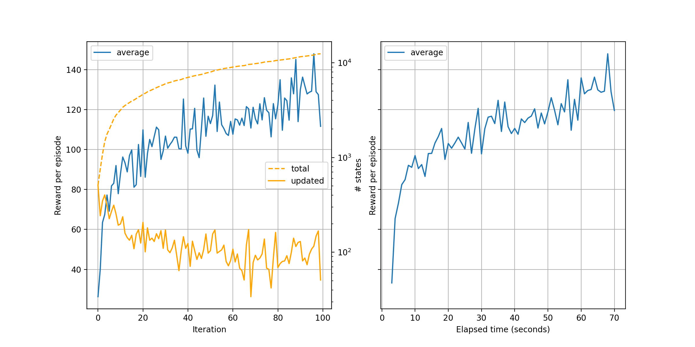

# Using RLAI from the Command-Line Interface

Installing RLAI from PyPI will install the source code for the package, and it will also create a command-line 
interface (CLI) that can be used to invoke RLAI functionality. This guide focuses on the CLI. Note that the CLI 
exposes the full breadth and depth of the RLAI package. It is powerful, but it can be challenging to use correctly.
Please see the [JupyterLab](jupyterlab_guide.md) guide for a graphical interface to RLAI.

Issue the following command to test whether installation succeeded.

```
rlai train --help
```
The output of the above command should be something like the following.
```
usage: rlai train [--help] [--agent AGENT] [--environment ENVIRONMENT] [--planning-environment PLANNING_ENVIRONMENT] [--train-function TRAIN_FUNCTION] [--resume]
                  [--save-agent-path SAVE_AGENT_PATH]

Train an agent in an environment.

optional arguments:
  --help                Print usage and argument descriptions.
  --agent AGENT         Fully-qualified type name of agent to train.
  --environment ENVIRONMENT
                        Fully-qualified type name of environment to train agent in.
  --planning-environment PLANNING_ENVIRONMENT
                        Fully-qualified type name of planning environment to train agent in.
  --train-function TRAIN_FUNCTION
                        Fully-qualified type name of function to use for training the agent.
  --resume              Resume training an agent from a checkpoint path.
  --save-agent-path SAVE_AGENT_PATH
                        Path to store resulting agent to.

/Users/mvg0419/Repos/rl/src/rlai/runners/trainer.py:244: UserWarning: No training function specified. Cannot train.
```

## Training an Agent in an Environment
As shown above, `rlai train` expects several inputs to train an agent. Despite the indication that the arguments are all
optional, this is not really the case. Some are required in order for training to run, and we describe these below.
Keep in mind that many more options become available depending on the agent, environment, and training function 
specified.

### `--agent`
The most commonly used agent in RLAI is the `StochasticMdpAgent`. Additional details can be shown by specifying this 
agent within the `rlai help` command.
```
rlai help rlai.agents.mdp.StochasticMdpAgent
```
The following output explains the `StochasticMdpAgent`.
```
usage: rlai.agents.mdp.StochasticMdpAgent [--help] [--gamma GAMMA]

optional arguments:
  --help         Print usage and argument descriptions.
  --gamma GAMMA  Discount factor.
```
As indicated, a discount factor needs to be supplied.

### `--environment`
Moving on to the environment, we can explore the [OpenAI Gym](https://gym.openai.com/) integration.
```
rlai help rlai.environments.openai_gym.Gym
```
The following output explains what is required for Gym environments.
```
usage: rlai.environments.openai_gym.Gym [--help] [--T T] [--gym-id GYM_ID] [--continuous-action-discretization-resolution CONTINUOUS_ACTION_DISCRETIZATION_RESOLUTION]
                                        [--render-every-nth-episode RENDER_EVERY_NTH_EPISODE] [--video-directory VIDEO_DIRECTORY]

optional arguments:
  --help                Print usage and argument descriptions.
  --T T                 Maximum number of time steps to run.
  --gym-id GYM_ID       Initial seed count in each pit.
  --continuous-action-discretization-resolution CONTINUOUS_ACTION_DISCRETIZATION_RESOLUTION
                        Continuous-action discretization resolution.
  --render-every-nth-episode RENDER_EVERY_NTH_EPISODE
                        How often to render episodes into videos.
  --video-directory VIDEO_DIRECTORY
                        Local directory in which to save rendered videos. Must be an empty directory. Ignore to only display videos.
```

### `--train-function`
Moving on to the training function, we can obtain help for the temporal difference training function as follows.
```
rlai train --train-function rlai.gpi.temporal_difference.iteration.iterate_value_q_pi --help
```
The following help is generated.
```
usage: rlai.gpi.temporal_difference.iteration.iterate_value_q_pi [--help] [--num-improvements NUM_IMPROVEMENTS] [--num-episodes-per-improvement NUM_EPISODES_PER_IMPROVEMENT] [--alpha ALPHA]
                                                                 [--epsilon EPSILON] [--make-final-policy-greedy {True,False}] [--num-improvements-per-plot NUM_IMPROVEMENTS_PER_PLOT]
                                                                 [--num-improvements-per-checkpoint NUM_IMPROVEMENTS_PER_CHECKPOINT] [--checkpoint-path CHECKPOINT_PATH] [--mode MODE]
                                                                 [--n-steps N_STEPS] [--q-S-A Q_S_A]

optional arguments:
  --help                Print usage and argument descriptions.
  --num-improvements NUM_IMPROVEMENTS
                        Number of improvements.
  --num-episodes-per-improvement NUM_EPISODES_PER_IMPROVEMENT
                        Number of episodes per improvement.
  --alpha ALPHA         Step size.
  --epsilon EPSILON     Total probability mass to allocate across all policy actions.
  --make-final-policy-greedy {True,False}
                        Whether or not to make the final policy greedy after training is complete.
  --num-improvements-per-plot NUM_IMPROVEMENTS_PER_PLOT
                        Number of improvements per plot.
  --num-improvements-per-checkpoint NUM_IMPROVEMENTS_PER_CHECKPOINT
                        Number of improvements per checkpoint.
  --checkpoint-path CHECKPOINT_PATH
                        Path to checkpoint file.
  --mode MODE           Temporal difference evaluation mode (SARSA, Q_LEARNING, EXPECTED_SARSA).
  --n-steps N_STEPS     N-step update value.
  --q-S-A Q_S_A         Fully-qualified type name of state-action value estimator to use.
```

### `--q-S-A`
The output above indicates the need for `--q-S-A`, which is the state-action value estimator to use. Explore the 
tabular estimator as follows.
```
rlai help rlai.value_estimation.tabular.TabularStateActionValueEstimator
```
The following output is generated.
```
usage: rlai.value_estimation.tabular.TabularStateActionValueEstimator [--help] [--continuous-state-discretization-resolution CONTINUOUS_STATE_DISCRETIZATION_RESOLUTION]

optional arguments:
  --help                Print usage and argument descriptions.
  --continuous-state-discretization-resolution CONTINUOUS_STATE_DISCRETIZATION_RESOLUTION
                        Continuous-state discretization resolution.
```

### Complete Command
Putting it all together and adding the `--save-agent-path` option, we have the following full command for training an
agent for the OpenAI Gym cartpole (inverted pendulum) environment.
```
rlai train --agent rlai.agents.mdp.StochasticMdpAgent --gamma 1.0 --environment rlai.environments.openai_gym.Gym --T 1000 --gym-id CartPole-v1 --render-every-nth-episode 5000 --train-function rlai.gpi.temporal_difference.iteration.iterate_value_q_pi --mode Q_LEARNING --num-improvements 100 --num-episodes-per-improvement 50 --epsilon 0.01 --q-S-A rlai.value_estimation.tabular.TabularStateActionValueEstimator --continuous-state-discretization-resolution 0.1 --make-final-policy-greedy True --num-improvements-per-plot 100 --save-agent-path ~/Desktop/cartpole_agent.pickle
```
A video should be rendered at the start of training, and a plot will be rendered at the end similar to the following.

Details of training plots like this one are provided in the Case Studies 
(e.g., [cartpole](case_studies/inverted_pendulum.md)).